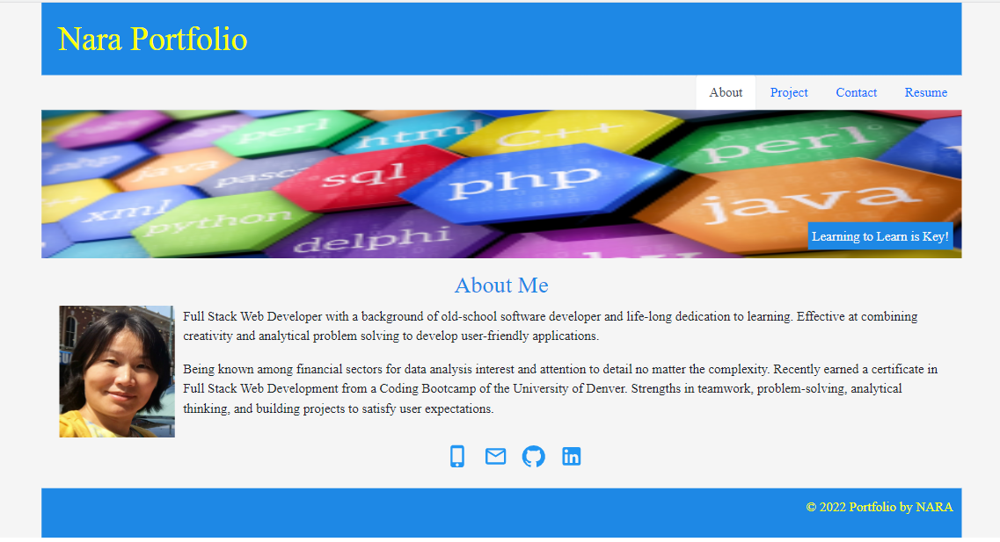
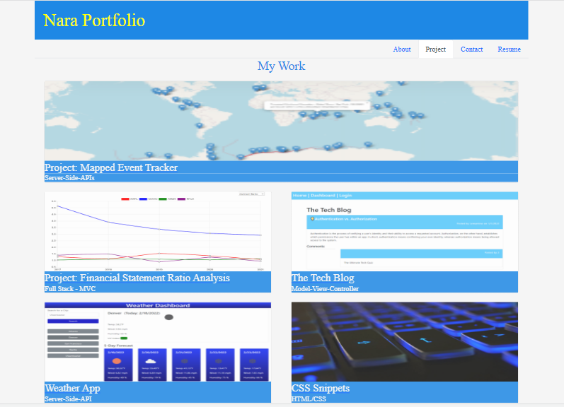

Nara's Portfolio Website built with ReactJS

## Table of Contents 

- [Description](#description)
- [User Story](#user-story)
- [Solution](#solution)
- [Live](#live)

## Description

I upgraded my portfolio webpage using my React skills. It is a single-page application built completely from scratch and deployed to Heroku. This application uses the following packages and dependencies: 
- [create-react-app](https://create-react-app.dev)
- [react-bootstrap](https://react-bootstrap.github.io/)
- [Material UI library](https://mui.com/) 
- [Bootstrap](https://getbootstrap.com/)

From the design side, here are a few challenges I decided to take:

- Mobile-first design.
- A color scheme generator [Coolors](https://coolors.co/) distinguishes from the default Bootstrap theme or unstyled HTML sites. 
- The `Material UI` library works great with React.js for Styling. 

## User Story

```md
AS AN employer looking for candidates with experience building single-page applications
I WANT to view a potential employee's deployed React portfolio of work samples
SO THAT I can assess whether they're a good candidate for an open position
```

## Solution

This is a single-page application for a web developer's portfolio. The portfolio is presented with a page containing a header, a section for content, and a footer component, which is appeared on multiple pages:

* A single `Header` component: The header is presented with the name and navigation with titles corresponding to different sections of the portfolio.

* A single `Navigation` component: Within the header, the navbar is used to conditionally render About Me, Project, Contact, and Resume sections.

* A single `Icons` component: The icons component is presented with Phone, Email, Github, and LinkedIn `Material UI` icons with links. I tested to use the `Material UI` library only on this component.

* A single `Footer` component that appears on multiple pages.

When the portfolio website loads the first time, the About Me tab is selected by default. The About Me section includes a recent photo or avatar of the developer and a short bio about me.

The Portfolio section includes titled images of five of the developer’s applications. For each project that is featured in the portfolio, including the following:

- An image of the deployed application 
- The title of the project
- A link to the deployed application
- A link to the corresponding GitHub repository.

The Contact Me section includes a contact form with fields for a name, an email address, and a message. When I move my cursor out of one of the form fields without entering text, the user receive a notification that this field is required. Also, the email address field is validated by the application using a helper function in the back-end.

The Resume section includes a link to a downloadable resume and a list of the developer’s skills.

### Wireframe

The portfolio webpage's sections and links:
```
Nara Portfolio
│
│ --About (profile photo and short introduction)
│
│ --Project (my latest 5 project links)
│
│ --Resume (downloadable PDF file)
│
└───Contact
    │
    └─── Phone
    │
    └─── Email
    │
    └─── GitHub (https://github.com/Nara1469)
    │
    └─── LinkedIn (https://linkedin.com/in/naradavaasuren)
```

## Live

This web application is deployed to Heroku.com. Here is a link to the deployed website. [Heroku - Nara Portfolio](https://portfolio-of-nara.herokuapp.com/)

If you have any questions about the repo, open an issue or contact me directly at naraamtm@gmail.com. Here is a link to this application repo on [GitHub](https://github.com/Nara1469/portfolio).

The following image shows the deployed webpage’s appearance: 

Some of my projects are displayed in the Project section with website and repo links: 